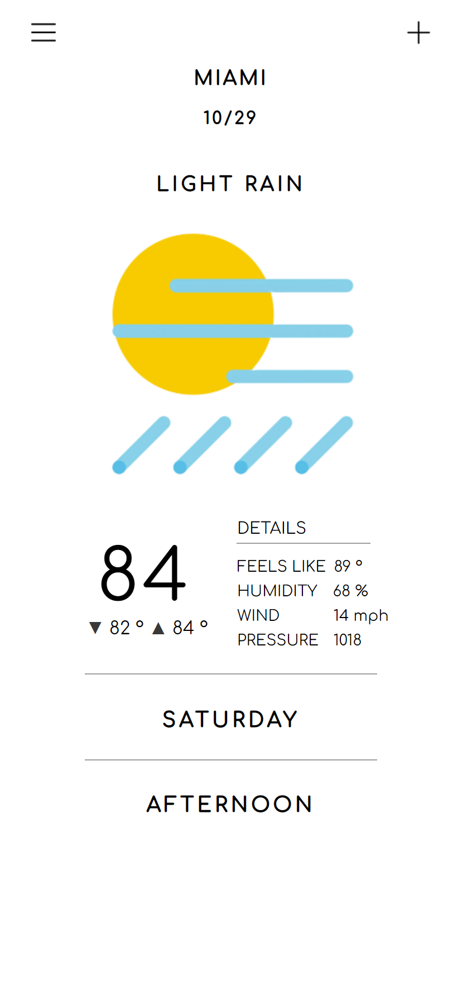
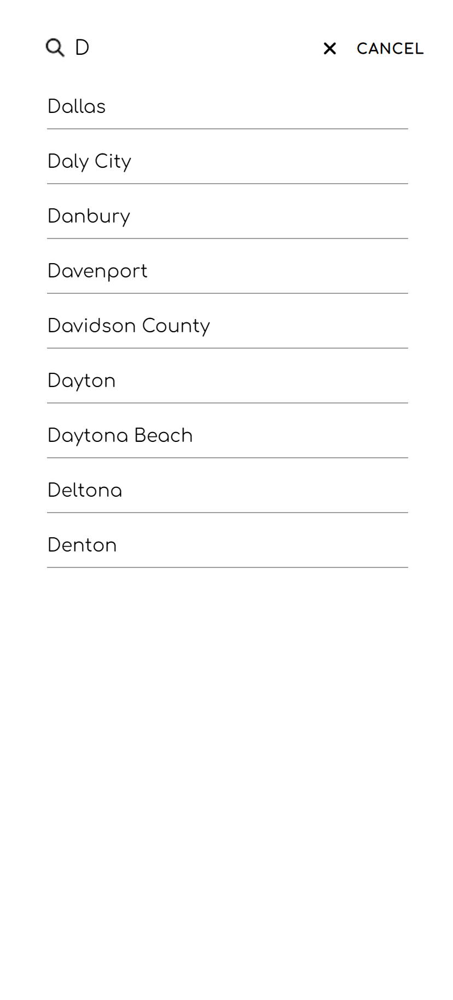
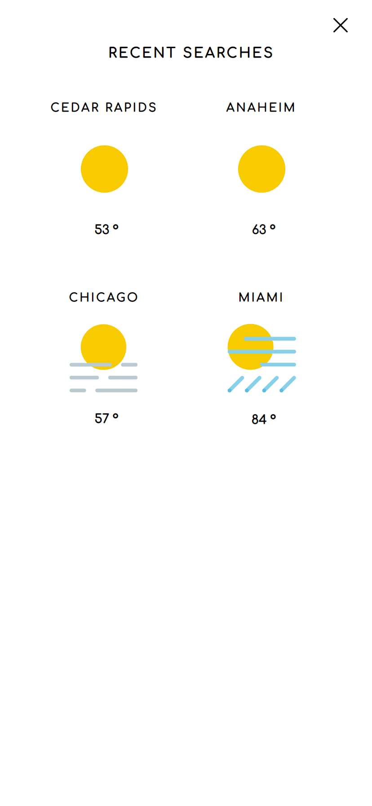

# weather-dashboard

https://ken862734801.github.io/Tic-Tac-Toe/

## Preview

View on mobile

## Summary

The goal of this assignment was to create a tic-tac-toe browser game using factory functions, module patterns, and a limited amount of global variables.

Going into this project, I really wasn't looking forward to it and was even thinking about skipping it because I felt as though tic-tac-toe was boring compared to the previous odin project assignments; HOWEVER, I'M GLAD I DIDN'T. Having to limit the amount of global code present made me really have to consider the flow of the game and what functions and variables would tie in together. Unfortunately, I wasn't able to complete the project without the use of some global variables, and ended up making the players global. I plan to revisit and refactor the code, and possibly implement a "vs computer" option in the future, but for now it works, and I feel like I learned alot. 

### Features
- WE ALL KNOW THE RULES OF TIC-TAC-TOE. 

### To-Do???
- Add an option to play against computer.
- Implement the minmax AI algorithm.... lol